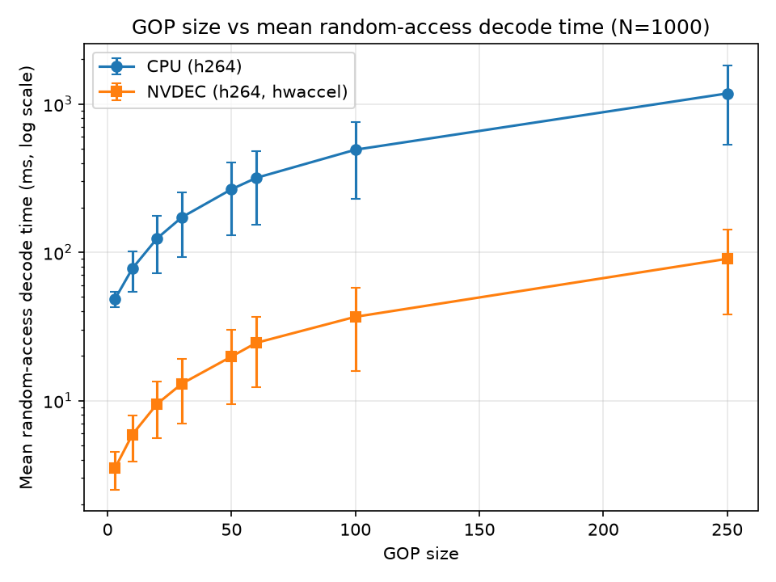

# validation

this is code to validate different libraries when it comes to training utilities such as
- pyav
- decord

## Random access vs GOP — CPU vs NVDEC (N=1000)

Measured with `seek_test.sh` (`pyav_loader.py` for CPU software decode,
`pyav_nvdec_loader.py` for NVDEC), N=1000 random seeks per video.
Results from `out.txt` (converted to ms): first block
(`decoder: h264 | is_hwaccel: False`) is CPU, second block
(`decoder: h264 | is_hwaccel: True | hwaccel: <HWAccel ...>`) is NVDEC.
GOP is the nominal value from the filename (matches measured `video GOP`);
file size measured from `vids/test_decode_*.mp4` (MB = bytes / 1e6).

| video | GOP size | file size | mean ± std CPU (ms) | mean ± std NVDEC (ms) |
|---|---|---|---|---|
| `test_decode_250.mp4` | 250 | 187.8 MB (187766674 B) | 1176.4 ± 644.8 | 90.3 ± 52.3 |
| `test_decode_100.mp4` | 100 | 188.0 MB (187973340 B) | 491.1 ± 260.9 | 36.7 ± 20.8 |
| `test_decode_60.mp4` | 60 | 188.2 MB (188179860 B) | 317.2 ± 164.9 | 24.5 ± 12.2 |
| `test_decode_50.mp4` | 50 | 188.3 MB (188317911 B) | 265.8 ± 135.0 | 19.8 ± 10.3 |
| `test_decode_30.mp4` | 30 | 188.8 MB (188800197 B) | 172.2 ± 79.9 | 13.0 ± 6.0 |
| `test_decode_20.mp4` | 20 | 189.4 MB (189411043 B) | 124.1 ± 52.3 | 9.5 ± 3.9 |
| `test_decode_10.mp4` | 10 | 191.4 MB (191408276 B) | 77.7 ± 23.9 | 5.9 ± 2.0 |
| `test_decode_3.mp4` | 3 | 204.7 MB (204724990 B) | 48.4 ± 6.0 | 3.5 ± 1.0 |

*GOP size vs mean random-access decode time (ms, log scale, ± std error bars).
Generated with `plot_gop.py`: `uv run --with matplotlib python plot_gop.py`.*
